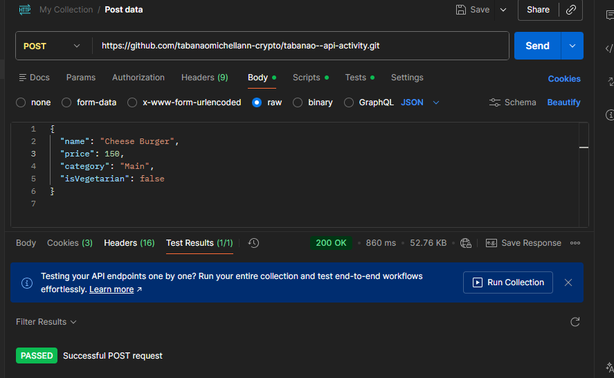

README.md Template:
1. Markdown
2. # RESTful API Activity - [Michell Ann Tabanao]

3. ## Best Practices Implementation
4. **1. Environment Variables:**
5. - Why did we put `BASE_URI` in `.env` instead of hardcoding it?
6. - Answer: BASE_URI is stored in .env to keep configuration separate from the code. This improves security, makes it easy to switch between environments, and allows changes without modifying the source code.
7. **2. Resource Modeling:**
8. - Why did we use plural nouns (e.g., `/dishes`) for our routes?
9. - Answer: Plural nouns are used to represent a collection of resources, not a single item. This follows RESTful API conventions, keeps endpoints consistent and predictable, and makes it clear when we are working with multiple records versus a specific one (e.g., /dishes/1).
10. **3. Status Codes:**
11. - When do we use `201 Created` vs `200 OK`?
    - Answer: 201 Created is used when a request successfully creates a new resource, while 200 OK is used when a request is successful but does not create a new resource, such as fetching or updating data.
12. - Why is it important to return `404` instead of just an empty array or a generic error?
13. - Answer: It’s important to return **`404 Not Found`** because it clearly tells the client that the requested resource does not exist. This avoids confusion, makes errors easier to handle on the client side, and follows RESTful standards, unlike returning an empty array or a generic error which can be misleading.

14.
15. **4. Testing:**
16. - 
17. - 

--Why did I choose to embed the Review / Tag / Log?

I chose to embed the Review/Tag/Log because these data elements are tightly coupled with the main record and are primarily accessed together. Embedding allows the system to retrieve all related information in a single database query, which improves performance and reduces query complexity. Since reviews, tags, and logs are not frequently accessed independently and usually do not grow excessively large, embedding them ensures faster read operations, better data locality, and simpler data modeling.

Why did I choose to reference the Chef / User / Guest?

I chose to reference the Chef/User/Guest because these entities are shared across multiple records and may be associated with different dishes, orders, or activities within the system. Referencing prevents data duplication, maintains data consistency, and allows updates to user or chef information to be reflected across all related records. This approach also supports scalability and flexibility, especially when the referenced entity contains extensive or frequently updated data.